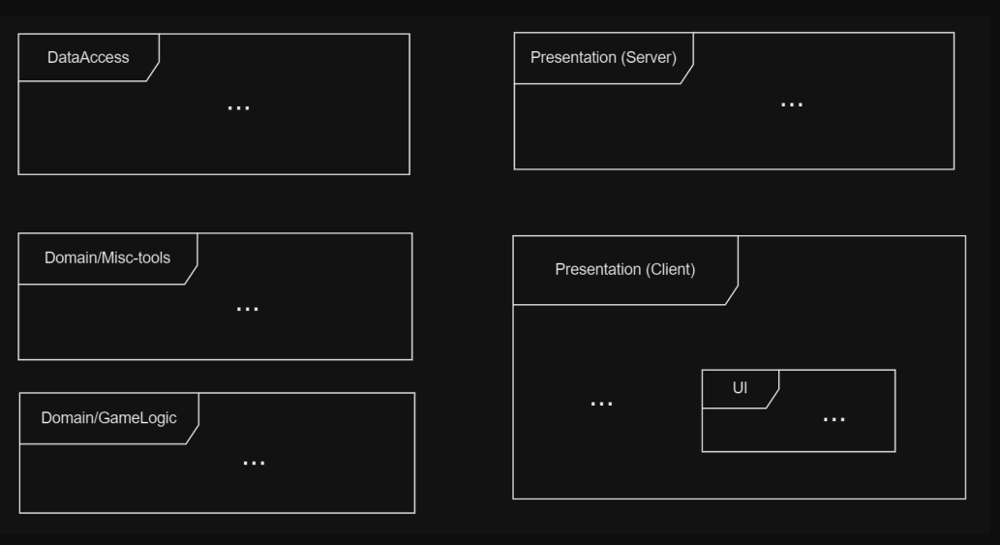

## General architecture

## Tools, services and libraries used in every layer

### Data access
- [Kysely](https://kysely.dev/) - SQL query builder and migration tooling
- [pg-mem](https://github.com/oguimbal/pg-mem) - simple InMemory postgres implementation for unit testint
- [Neon](https://auth0.com/) - PostgreSQL hosting provider

### Domain/tools
Here situation is more dynamic, but for now:
- [Auth0](https://auth0.com/) - Authentication and authorization service
- [HugginFace](https://huggingface.co/) - AI stuff hosting
- [Supabase](https://supabase.com/) - File storage hosting

### Domain/Game-logic
Heart of the project - no concrete dependencies

### Presentation (Server)
- [expres.js](https://expressjs.com/) - HTTP server
- [Socket.io](https://socket.io/) - 2-way communication event base communication library

### Presentation (client)
- [zustand](https://github.com/pmndrs/zustand) - state management
- [Tanstack router](https://tanstack.com/router/latest) - routing library

## UI
- [Tailwindcss](https://tailwindcss.com/) - CSS framework
- [Shadcn](https://ui.shadcn.com/) - component library

## Additional tools and formatters
- [Prettier](https://prettier.io/) - JS/TS formatter
- [ESLint](https://eslint.org/) - JS/TS linter